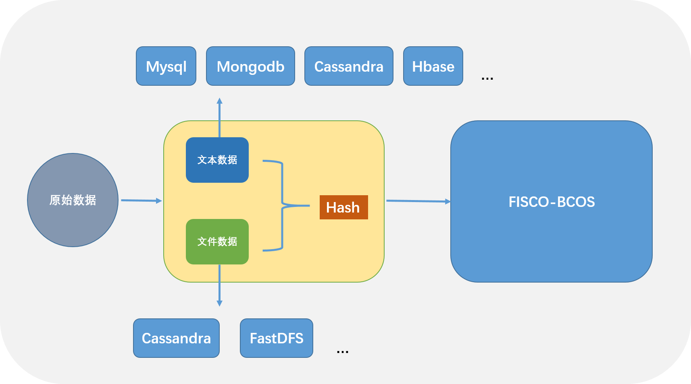
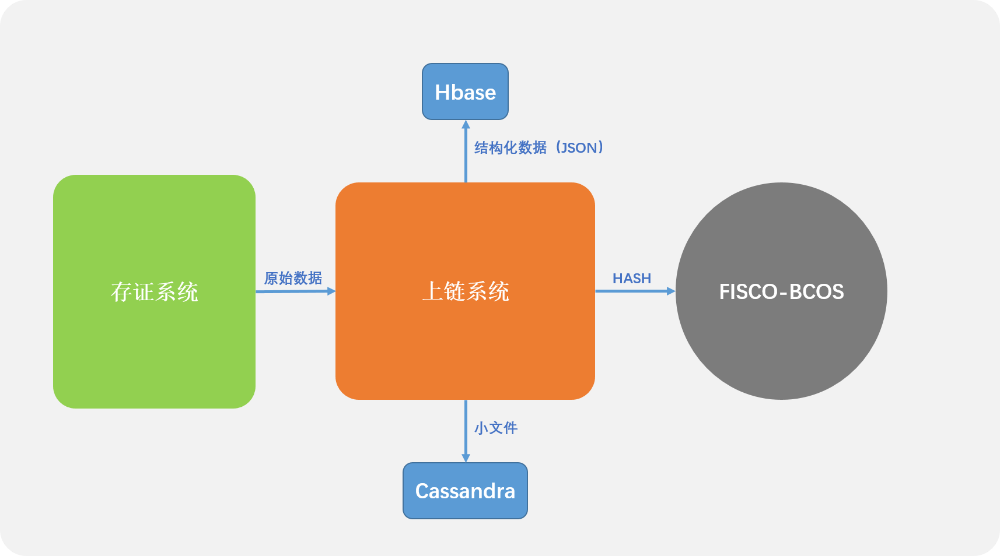
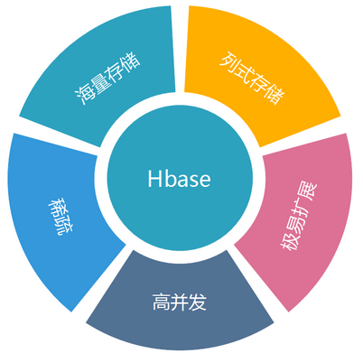
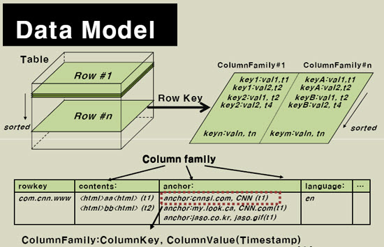
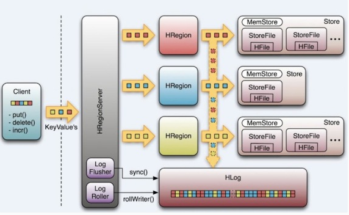
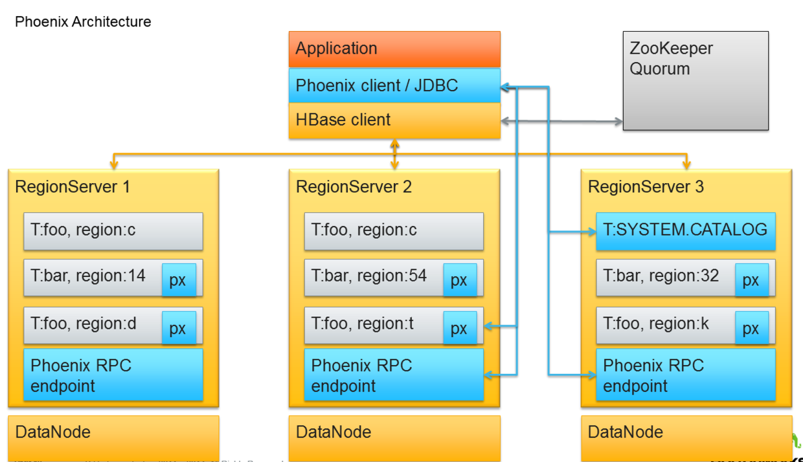
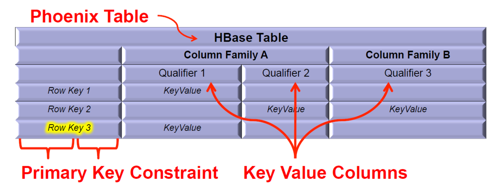
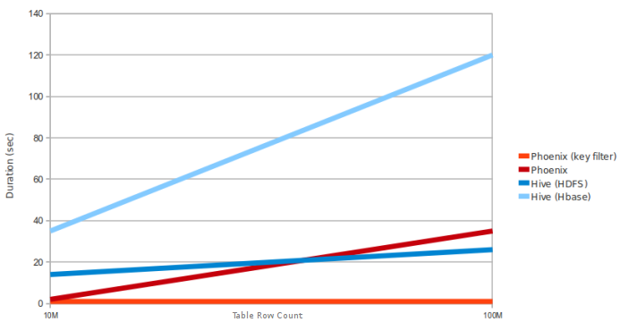
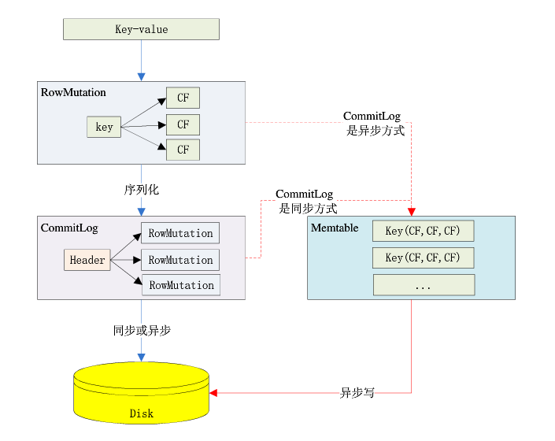
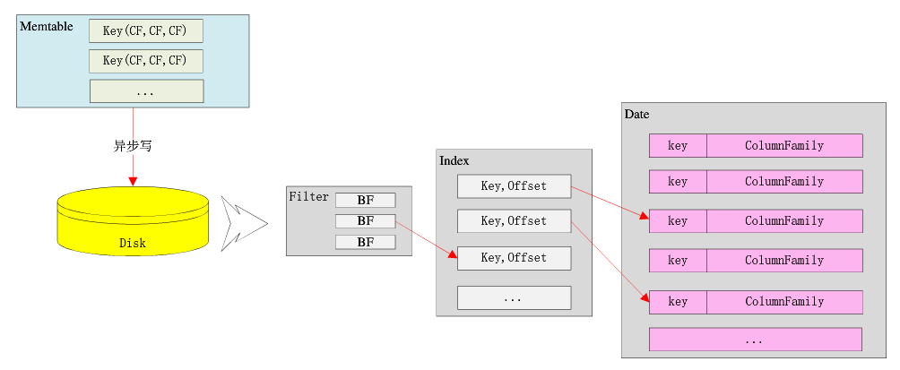

# 海量存证数据 + 区块链实现

<!-- TOC -->

- [海量存证数据 + 区块链实现](#海量存证数据 + 区块链实现)
	- [区块链存证目前存在的挑战](#区块链存证目前存在的挑战)
	- [优化实现方案](#优化实现方案)
	- [亦笔科技的存证数据存储实现](#亦笔科技的存证数据存储实现)
	    - [为什么使用Phoenix+Hbase](#为什么使用Phoenix+Hbase)
	    - [Hbase数据模型](#Hbase数据模型)
	    - [Hbase分片基础的Region](#Hbase分片基础的Region)
	    - [Hbase在业务实现上存在的不足](#Hbase在业务实现上存在的不足)
	    - [Phoenix架构](#Phoenix架构)
	    - [Phoenix性能对比](#Phoenix性能对比)
	    - [Cassandra如何快速、可靠的存储小文件](#Cassandra如何快速、可靠的存储小文件)
	    - [Cassandra数据的写入](#Cassandra数据的写入)
	    - [Cassandra数据的读取](#Cassandra数据的读取)
	    - [总结](#总结)
	    
<!-- /TOC -->

## 区块链存证目前存在的挑战
1. 鉴于目前区块链的发展现状，大数据量的文本、文件信息直接存储在区块链系统之中会导致系统的处理性能明显下降，并且每个节点都需要有足够大的存储空间支持，无法满足目前金融行业对系统性能的较高要求。
2. 随着存证系统日益庞大的数据量导致系统的存储与查询性能急剧下降，对系统的高可用、水平扩容也有着较高的要求。

## 优化实现方案
在hash上链，联盟节点参与背书的基本条件不变的情况下，对原始数据进行hash计算方式及存储进行适配处理。支持document（json）、文件存储和加密的可插拔实现。

## 亦笔科技的存证数据存储实现

- Hbase对于海量文档数据存储有较好的支持，目前hadoop技术体系也相对成熟稳定。使用Phoenix+Hbase支持海量数据的存储、随机查询。
- Cassandra也是一种点对点的分布式nosql数据库，对于小文档数据存储有良好的表现。支持海量文件数据的读写，节点数据自动同步。

### 为什么使用Phoenix + Hbase

在存证场景中，许多合作对象所需要存证的数据很难保持高度一致。NoSQL数据库更适用于高扩展性的数据存储需求。海量存储、高并发同时也是很适合存证的业务诉求。而稀疏的特性也大大节约了存储空间。

### Hbase数据模型

HBase 以表的形式存储数据。表由行和列组成。列划分为若干个列族（row family），如下图所示。

Rowkey的概念和mysql中的主键是完全一样的，Hbase使用Rowkey来唯一的区分某一行的数据。每个Region负责一小部分Rowkey范围的数据的读写和维护，Region包含了对应的起始行到结束行的所有信息。master将对应的region分配给不同的RergionServer，由RegionSever来提供Region的读写服务和相关的管理工作。

Hbase只支持3中查询方式：
1. 基于Rowkey的单行查询；
2. 基于Rowkey的范围扫描
3. 全表扫描

### Hbase分片基础的Region

Region的概念和关系型数据库的分区或者分片差不多。
Hbase会将一个大表的数据基于Rowkey的不同范围分配到不通的Region中，每个Region负责一定范围的数据访问和存储。这样即使是一张巨大的表，由于被切割到不通的region，访问起来的时延也很低。

### Hbase在业务实现上存在的不足

Hbase帮我们解决了结构化数据的高并发写入和读取，但是无法满足我们对于随机查询的需求。在HBase中，只有一个单一的按照字典序排序的rowKey索引，当使用rowKey来进行数据查询的时候速度较快，但是如果不使用rowKey来查询的话就会使用filter来对全表进行扫描，很大程度上降低了检索性能。而Phoenix提供了二级索引技术来应对这种使用rowKey之外的条件进行检索的场景。

### Phoenix架构

主要特性：
1. 二级索引
2.	分页查询
3.	散列表
4.	视图
5.	动态列
6.	SQL支持

Phoenix将HBase的数据模型映成关系型数据表示意：

### Phoenix性能对比
Phoenix通过以下方法来奉行把计算带到离数据近的地方的哲学：
- 协处理器
在服务端执行操作来最小化服务端和客户端的数据传输
- 定制的过滤器
为了删减数据使之尽可能地靠近源数据并最小化启动代价，Phoenix使用原生的HBase APIs而不是使用Map/Reduce框架

### Cassandra如何快速、可靠的存储小文件

Cassandra的存储机制借鉴了Bigtable的设计，采用Memtable和SSTable的方式。

Cassandra 中的数据主要分为三种：
1.	CommitLog：主要记录下客户端提交过来的数据以及操作。这个数据将被持久化到磁盘中，以便数据没有被持久化到磁盘时可以用来恢复。 
2.	Memtable：用户写的数据在内存中的形式，它的对象结构在后面详细介绍。其实还有另外一种形式是 BinaryMemtable 这个格式目前 Cassandra 并没有使用，这里不再介绍了。 
3.	SSTable：数据被持久化到磁盘，这又分为 Data、Index 和 Filter 三种数据格式。 

#### CommitLog 数据格式

CommitLog 的数据只有一种，那就是按照一定格式组成 byte 组数，写到 IO 缓冲区中定时的被刷到磁盘中持久化，在上一篇的配置文件详解中已经有说到 CommitLog 的持久化方式有两种，一个是 Periodic 一个是 Batch，它们的数据格式都是一样的，只是前者是异步的，后者是同步的，数据被刷到磁盘的频繁度不一样。它持久化的策略也很简单，就是首先将用户提交的数据所在的对象 RowMutation 序列化成 byte 数组，然后把这个对象和 byte 数组传给 LogRecordAdder 对象，由 LogRecordAdder 对象调用 CommitLogSegment 的 write 方法去完成写操作。

#### CommitLog文件数组结构

#### Memtable 内存中数据结构

Memtable 内存中数据结构比较简单，一个 ColumnFamily 对应一个唯一的 Memtable 对象，所以 Memtable 主要就是维护一个 ConcurrentSkipListMap<DecoratedKey, ColumnFamily> 类型的数据结构，当一个新的 RowMutation 对象加进来时，Memtable 只要看看这个结构是否 <DecoratedKey, ColumnFamily> 集合已经存在，没有的话就加进来，有的话取出这个 Key 对应的 ColumnFamily，再把它们的 Column 合并。
Cassandra 的写的性能很好，好的原因就是因为 Cassandra 写到数据首先被写到 Memtable 中，而 Memtable 是内存中的数据结构，所以 Cassandra 的写是写内存的，下图基本上描述了一个 key/value 数据是怎么样写到 Cassandra 中的 Memtable 数据结构中的。

#### SSTable 数据格式

每添加一条数据到 Memtable 中，程序都会检查一下这个 Memtable 是否已经满足被写到磁盘的条件，如果条件满足这个 Memtable 就会写到磁盘中。
Memtable 的条件满足后，它会创建一个 SSTableWriter 对象，然后取出 Memtable 中所有的 <DecoratedKey, ColumnFamily> 集合，将 ColumnFamily 对象的序列化结构写到 DataOutputBuffer 中。接下去 SSTableWriter 根据 DecoratedKey 和 DataOutputBuffer 分别写到 Date、Index 和 Filter 三个文件中。

SSTable 的 Data 文件结构

Index 文件结构

Filter 文件结构

三个文件对应的数据格式可以用下图来清楚的表示：

这个三个文件写完后，还要做的一件事件就是更新前面提到的 CommitLog 文件，告诉 CommitLog 的 header 所存的当前 ColumnFamily 的没有写到磁盘的最小位置。

### Cassandra数据的写入

CassandraServer 接收到要写入的数据时，首先创建一个 RowMutation 对象，再创建一个 QueryPath 对象，这个对象中保存了 ColumnFamily、Column Name 或者 Super Column Name。接着把用户提交的所有数据保存在 RowMutation 对象的 Map<String, ColumnFamily> 结构中。接下去就是根据提交的 Key 计算集群中那个节点应该保存这条数据。这个计算的规则是：将 Key 转化成 Token，然后在整个集群的 Token 环中根据二分查找算法找到与给定的 Token 最接近的一个节点。如果用户指定了数据要保存多个备份，那么将会顺序在 Token 环中返回与备份数相等的节点。这是一个基本的节点列表，后面 Cassandra 会判断这些节点是否正常工作，如果不正常寻找替换节点。还有还要检查是否有节点正在启动，这种节点也是要在考虑的范围内，最终会形成一个目标节点列表。最 后把数据发送到这些节点。
接下去就是将数据保存到 Memtable 中和 CommitLog 中，关于结果的返回根据用户指定的安全等级不同，可以是异步的，也可以是同步的。如果某个节点返回失败，将会再次发送数据。

### Cassandra数据的读取

Cassandra 的写的性能要好于读的性能，为何写的性能要比读好很多呢？原因是，Cassandra 的设计原则就是充分让写的速度更快、更方便而牺牲了读的性能。事实也的确如此，仅仅看 Cassandra 的数据的存储形式就能发现，首先是写到 Memtable 中，然后将 Memtable 中数据刷到磁盘中，而且都是顺序保存的不检查数据的唯一性，而且是只写不删（删除规则在后面介绍），最后才将顺序结构的多个 SSTable 文件合并。这每一步难道不是让 Cassandra 写的更快。这个设计想想对读会有什么影响。首先，数据结构的复杂性，Memtable 中和 SSTable 中数据结构肯定不同，但是返回给用户的肯定是一样的，这必然会要转化。其次，数据在多个文件中，要找的数据可能在 Memtable 中，也可能在某个 SSTable 中，如果有 10 个 SSTable，那么就要在到 10 个 SSTable 中每个找一遍，虽然使用了 BloomFilter 算法可以很快判断到底哪个 SSTable 中含有指定的 key。还有可能在 Memtable 到 SSTable 的转化过程中，这也是要检查一遍的，也就是数据有可能存在什么地方，就要到哪里去找一遍。还有找出来的数据可能是已经被删除的，但也没办法还是要取。

### 总结

在分布式海量数据应用场景下，对于技术方案选型对整个系统的设计架构起到了非常关键的作用。在存证应用场景下，数据的写入场景远远大于读取，查询实时性要求也相对较高，Cassandra、Hbase的特性非常适用于此场景。